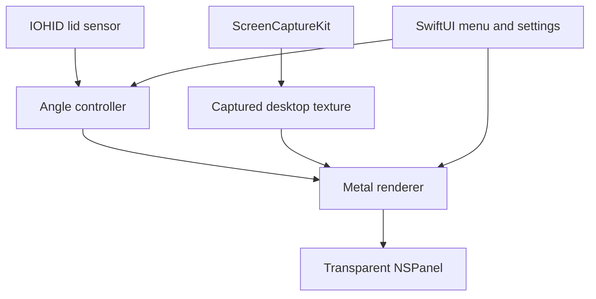

# DuoFX: Building a Lid-Aware Desktop Folding Effect for macOS

> **Visual behavior update:** The implementation now keeps the desktop fixed and sweeps a soft blur boundary from top to bottom as the lid closes. Opening reverses the sweep. Uncovered pixels are transparent in the overlay; the blurred region samples the desktop at unchanged coordinates. Blur strength, edge softness, and optional dimming replace perspective, stretch, viewing distance, and fade-to-black controls. The folding/projection sections below describe the original proposal and are superseded by this update. Capture, sensor, privacy, and lifecycle requirements still apply.

## 1. Project overview

DuoFX is a native macOS menu-bar application that visually folds, tilts, blurs, shades, and fades the desktop while the user closes the MacBook lid.

The application combines four pieces:

1. **IOKit/IOHID** reads the MacBook's hinge angle.
2. **ScreenCaptureKit** captures the built-in display in real time.
3. **Metal** transforms and renders the captured desktop.
4. **AppKit and SwiftUI** provide the transparent overlay, menu-bar controls, and settings.

The recommended minimum target is macOS 14 Sonoma on an Apple-silicon MacBook. The first supported device should be the developer's own MacBook; broader hardware compatibility can be added after the core effect works.

> Important: Apple publicly documents ScreenCaptureKit, Metal, SwiftUI, and AppKit, but it does not document the MacBook lid sensor's specific HID report format. Direct lid-angle integration may therefore break on future hardware or macOS releases and may be unsuitable for Mac App Store distribution.

## 2. Goals and non-goals

### Goals

- Run quietly as a menu-bar application.
- Follow the physical MacBook lid angle with low perceived latency.
- Capture and transform the desktop at up to 60 FPS.
- Keep desktop content on the device and in memory only.
- Allow the user to configure working angle, perspective, blur, shadow, stretch, fade, and effect style.
- Never block mouse or keyboard interaction with the real desktop.
- Stop screen capture when the effect is paused or no longer visible.

### Initial non-goals

- Intel Mac support.
- Mac App Store distribution.
- Exact compatibility with every MacBook model.
- Capturing system audio or microphone input.
- Modifying real windows or desktop content.
- Licensing, payment, or analytics.

## 3. Architecture



The important boundary is `LidAngleProviding`. The visual effect should work with either the physical sensor or a manual slider. This makes graphics development and automated testing possible without repeatedly moving the lid.

## 4. Technology choices

| Area | Technology | Reason |
| --- | --- | --- |
| Application lifecycle | SwiftUI | Modern menu-bar and settings implementation |
| Overlay window | AppKit `NSPanel` | Precise control over window level, transparency, spaces, and input |
| Desktop capture | ScreenCaptureKit | Apple's modern, efficient screen-capture API |
| Rendering | Metal and MetalKit | Low-latency GPU texture processing |
| Blur | Metal Performance Shaders | Efficient initial implementation without a custom blur pipeline |
| Sensor access | IOKit HID | Access to the hardware feature report containing the hinge angle |
| Observation | Observation framework | Simple SwiftUI-compatible state management |
| Settings | `UserDefaults` / `@AppStorage` | Sufficient for local visual preferences |

## 5. Suggested project structure

```text
DuoFX/
├── App/
│   ├── DuoFXApp.swift
│   ├── AppModel.swift
│   └── EffectCoordinator.swift
├── Sensor/
│   ├── LidAngleProviding.swift
│   ├── HIDAngleSensor.swift
│   ├── ManualAngleSensor.swift
│   └── SensorDiagnostic.swift
├── Capture/
│   ├── ScreenCaptureService.swift
│   └── CaptureError.swift
├── Rendering/
│   ├── MetalRenderer.swift
│   ├── TextureBridge.swift
│   ├── OverlayWindowController.swift
│   ├── MeshFactory.swift
│   └── Shaders.metal
├── Settings/
│   └── SettingsView.swift
├── Models/
│   ├── EffectConfiguration.swift
│   └── EffectStyle.swift
└── Tests/
    ├── AngleMappingTests.swift
    ├── AngleSmoothingTests.swift
    └── ProjectionTests.swift
```

## 6. Xcode setup

1. Create a new **macOS App** in Xcode.
2. Select **SwiftUI** for the interface and **Swift** for the language.
3. Set the deployment target to macOS 14 or newer.
4. Link the following frameworks when Xcode does not add them automatically:
   - ScreenCaptureKit
   - Metal
   - MetalKit
   - MetalPerformanceShaders
   - IOKit
5. Use an application bundle identifier such as `com.example.DuoFX`.
6. Begin development with the manual angle provider. Add real sensor access only after the capture and rendering pipeline works.

The application will request **Screen & System Audio Recording** permission when capture starts. Audio capture must remain disabled.

## 7. Core models

### Effect configuration

```swift
import Foundation
import Observation

enum EffectStyle: String, CaseIterable, Identifiable {
    case silk
    case shade
    case frost

    var id: Self { self }
}

@Observable
@MainActor
final class AppModel {
    var isEnabled = false
    var style: EffectStyle = .frost
    var workingAngle = 95.0
    var minimumAngle = 25.0
    var perspective = 0.75
    var verticalStretch = 0.25
    var blurStrength = 5.0
    var shadowStrength = 0.35
    var soundEnabled = false
}
```

### Sensor abstraction

```swift
import Observation

@MainActor
protocol LidAngleProviding: AnyObject {
    var angle: Double { get }
    var isAvailable: Bool { get }
    func start()
    func stop()
}

@Observable
@MainActor
final class ManualAngleSensor: LidAngleProviding {
    var angle = 95.0
    var isAvailable = true

    func start() {}
    func stop() {}
}
```

## 8. Menu-bar application

```swift
import SwiftUI

@main
struct DuoFXApp: App {
    @State private var model = AppModel()

    var body: some Scene {
        MenuBarExtra("DuoFX", systemImage: "laptopcomputer") {
            Toggle("Enable effect", isOn: $model.isEnabled)

            SettingsLink {
                Label("Settings…", systemImage: "gear")
            }

            Divider()

            Button("Quit") {
                NSApplication.shared.terminate(nil)
            }
        }

        Settings {
            SettingsView(model: model)
        }
    }
}
```

An early settings view should expose a manual angle slider:

```swift
import SwiftUI

struct SettingsView: View {
    @Bindable var model: AppModel
    @State private var previewAngle = 95.0

    var body: some View {
        Form {
            Picker("Style", selection: $model.style) {
                ForEach(EffectStyle.allCases) { style in
                    Text(style.rawValue.capitalized).tag(style)
                }
            }

            LabeledContent("Preview angle") {
                HStack {
                    Slider(value: $previewAngle, in: 20...120, step: 1)
                    Text("\(previewAngle, specifier: \"%.0f\")°")
                        .monospacedDigit()
                        .frame(width: 44)
                }
            }

            Slider(value: $model.perspective, in: 0...1) {
                Text("Perspective")
            }

            Slider(value: $model.blurStrength, in: 0...30) {
                Text("Blur")
            }
        }
        .padding()
        .frame(width: 460)
    }
}
```

## 9. Desktop capture

Use ScreenCaptureKit to capture only the built-in display. Exclude the current application to avoid capturing the overlay and creating recursive frames.

```swift
import CoreMedia
import ScreenCaptureKit

enum CaptureError: Error {
    case noDisplay
}

final class ScreenCaptureService: NSObject {
    private var stream: SCStream?
    private let captureQueue = DispatchQueue(
        label: "com.example.DuoFX.capture",
        qos: .userInteractive
    )

    var onFrame: (@Sendable (CVPixelBuffer) -> Void)?

    func start() async throws {
        let content = try await SCShareableContent.excludingDesktopWindows(
            false,
            onScreenWindowsOnly: true
        )

        guard let display = content.displays.first else {
            throw CaptureError.noDisplay
        }

        let ownBundleID = Bundle.main.bundleIdentifier
        let ownApplication = content.applications.first {
            $0.bundleIdentifier == ownBundleID
        }

        let filter = SCContentFilter(
            display: display,
            excludingApplications: ownApplication.map { [$0] } ?? [],
            exceptingWindows: []
        )

        let configuration = SCStreamConfiguration()
        configuration.width = display.width
        configuration.height = display.height
        configuration.minimumFrameInterval = CMTime(value: 1, timescale: 60)
        configuration.queueDepth = 3
        configuration.showsCursor = false
        configuration.capturesAudio = false
        configuration.pixelFormat = kCVPixelFormatType_32BGRA

        let stream = SCStream(
            filter: filter,
            configuration: configuration,
            delegate: self
        )

        try stream.addStreamOutput(
            self,
            type: .screen,
            sampleHandlerQueue: captureQueue
        )

        self.stream = stream
        try await stream.startCapture()
    }

    func stop() async {
        try? await stream?.stopCapture()
        stream = nil
    }
}

extension ScreenCaptureService: SCStreamOutput {
    func stream(
        _ stream: SCStream,
        didOutputSampleBuffer sampleBuffer: CMSampleBuffer,
        of type: SCStreamOutputType
    ) {
        guard type == .screen,
              sampleBuffer.isValid,
              let pixelBuffer = sampleBuffer.imageBuffer else {
            return
        }

        onFrame?(pixelBuffer)
    }
}

extension ScreenCaptureService: SCStreamDelegate {}
```

Production code should inspect ScreenCaptureKit frame-status attachments and discard incomplete frames.

## 10. Transparent overlay

The overlay is a borderless, non-activating `NSPanel` containing an `MTKView`.

```swift
import AppKit
import MetalKit

@MainActor
final class OverlayWindowController {
    private var panel: NSPanel?

    func show(renderer: MetalRenderer, on screen: NSScreen) {
        guard panel == nil else { return }

        let panel = NSPanel(
            contentRect: screen.frame,
            styleMask: [.borderless, .nonactivatingPanel],
            backing: .buffered,
            defer: false
        )

        panel.level = .screenSaver
        panel.backgroundColor = .clear
        panel.isOpaque = false
        panel.hasShadow = false
        panel.ignoresMouseEvents = true
        panel.collectionBehavior = [
            .canJoinAllSpaces,
            .fullScreenAuxiliary,
            .stationary
        ]

        let metalView = MTKView(frame: screen.frame, device: renderer.device)
        metalView.framebufferOnly = false
        metalView.enableSetNeedsDisplay = false
        metalView.isPaused = false
        metalView.delegate = renderer

        panel.contentView = metalView
        panel.orderFrontRegardless()
        self.panel = panel
    }

    func hide() {
        panel?.orderOut(nil)
        panel = nil
    }
}
```

`ignoresMouseEvents` is essential: the overlay must not prevent the user from interacting with the actual desktop.

## 11. Zero-copy Metal texture bridge

Convert each captured `CVPixelBuffer` into an `MTLTexture` through a `CVMetalTextureCache`.

```swift
import CoreVideo
import Metal

final class TextureBridge {
    private var cache: CVMetalTextureCache!

    init(device: MTLDevice) {
        CVMetalTextureCacheCreate(nil, nil, device, nil, &cache)
    }

    func texture(from pixelBuffer: CVPixelBuffer) -> MTLTexture? {
        let width = CVPixelBufferGetWidth(pixelBuffer)
        let height = CVPixelBufferGetHeight(pixelBuffer)
        var textureReference: CVMetalTexture?

        let result = CVMetalTextureCacheCreateTextureFromImage(
            nil,
            cache,
            pixelBuffer,
            nil,
            .bgra8Unorm,
            width,
            height,
            0,
            &textureReference
        )

        guard result == kCVReturnSuccess,
              let textureReference else {
            return nil
        }

        return CVMetalTextureGetTexture(textureReference)
    }
}
```

Do not copy full-resolution frames into Swift arrays or CPU-backed images. Keep capture and rendering on the GPU-oriented path.

## 12. Angle normalization and smoothing

Map the physical lid angle into effect progress:

```swift
func closingProgress(
    angle: Double,
    workingAngle: Double,
    minimumAngle: Double
) -> Float {
    let range = max(workingAngle - minimumAngle, 1)
    let rawProgress = (workingAngle - angle) / range
    return Float(min(max(rawProgress, 0), 1))
}
```

Example mapping with a 95-degree working angle and 25-degree minimum:

| Lid angle | Approximate progress | Visual state |
| ---: | ---: | --- |
| 95° | 0.00 | Transparent overlay / no effect |
| 78° | 0.24 | Light perspective |
| 60° | 0.50 | Visible compression and blur |
| 43° | 0.74 | Strong compression and shading |
| 25° | 1.00 | Edge-on and nearly black |

HID readings may contain small fluctuations. Apply an exponential moving average:

```swift
smoothedAngle += (rawAngle - smoothedAngle) * 0.18
```

For a more physical response, maintain angle and velocity and use a critically damped spring. Add hysteresis around the working angle so a stationary lid does not repeatedly show and hide the overlay.

## 13. Initial Metal shader

Start with a textured quad. This creates a useful prototype but is not a physically exact projection.

```metal
#include <metal_stdlib>
using namespace metal;

struct VertexIn {
    float2 position [[attribute(0)]];
    float2 textureCoordinate [[attribute(1)]];
};

struct Uniforms {
    float progress;
    float perspective;
    float verticalStretch;
    float opacity;
};

struct VertexOut {
    float4 position [[position]];
    float2 textureCoordinate;
    float shade;
};

vertex VertexOut bendVertex(
    VertexIn input [[stage_in]],
    constant Uniforms& uniforms [[buffer(1)]]
) {
    VertexOut output;
    float2 position = input.position;
    float verticalPosition = (position.y + 1.0) * 0.5;

    // Keep the bottom near the hinge and compress toward it.
    float compression = mix(1.0, 0.08, uniforms.progress);
    position.y = -1.0 + verticalPosition * 2.0 * compression;

    // Narrow the upper rows to imply perspective.
    float widthScale = 1.0
        - uniforms.progress
        * uniforms.perspective
        * verticalPosition
        * 0.32;
    position.x *= widthScale;

    position.y += verticalPosition
        * uniforms.progress
        * uniforms.verticalStretch;

    output.position = float4(position, 0.0, 1.0);
    output.textureCoordinate = input.textureCoordinate;
    output.shade = 1.0 - uniforms.progress * verticalPosition * 0.45;
    return output;
}

fragment float4 bendFragment(
    VertexOut input [[stage_in]],
    texture2d<float> desktop [[texture(0)]],
    sampler textureSampler [[sampler(0)]],
    constant Uniforms& uniforms [[buffer(0)]]
) {
    float4 color = desktop.sample(
        textureSampler,
        input.textureCoordinate
    );
    color.rgb *= input.shade;
    color.a *= uniforms.opacity;
    return color;
}
```

### Improving the projection

After the quad implementation works:

1. Replace the quad with a grid containing 32–128 horizontal segments.
2. Treat the display as a panel rotating around its lower edge.
3. Define an assumed viewer position relative to the hinge.
4. For each mesh row, calculate the point on the tilted panel.
5. Reproject that point onto the viewer's original image plane.
6. Fade to black before the panel reaches an edge-on position.

The viewer position should eventually become configurable because perceived projection depends on seating height and distance.

## 14. Blur, shadow, and styles

Implement the styles as presets over the same rendering pipeline:

| Style | Perspective | Blur | Shading | Character |
| --- | ---: | ---: | ---: | --- |
| Silk | Medium | Low | Low | Clean and lightweight |
| Shade | Medium | Medium | High | Dark and dramatic |
| Frost | High | High | Medium | Soft and glass-like |

For the first version, apply `MPSImageGaussianBlur` before the final rendering pass. Blur strength should depend on closing progress rather than remaining constant:

```swift
let effectiveBlur = configuration.blurStrength * Double(progress)
```

Add a vertical gradient or per-vertex shading toward the upper edge. Avoid expensive CPU-generated shadows.

## 15. Reading the physical lid angle

The open-source [LidAngleSensor](https://github.com/samhenrigold/LidAngleSensor) project is a useful hardware reference. It is Apache-2.0 licensed and includes device discovery, compatibility diagnostics, report decoding, smoothing, and velocity calculation.

Its central report-reading operation is conceptually:

```swift
import IOKit.hid

private var report = [UInt8](repeating: 0, count: 8)

func readAngle(from device: IOHIDDevice) -> Double? {
    var length = CFIndex(report.count)

    let result = IOHIDDeviceGetReport(
        device,
        kIOHIDReportTypeFeature,
        1,
        &report,
        &length
    )

    guard result == kIOReturnSuccess, length >= 3 else {
        return nil
    }

    let rawValue = UInt16(report[2]) << 8 | UInt16(report[1])
    return Double(rawValue)
}
```

Do not implement only this function and assume every Mac will work. Robust code must:

- Discover the correct HID service.
- Verify expected vendor, product, usage, and report properties.
- Open and close the device safely.
- Detect unsupported machines.
- Avoid multiple objects fighting over the same device handle.
- Provide a diagnostic screen for failed detection.
- Stop polling when the effect is disabled.

If code is reused from the reference project, preserve its Apache 2.0 copyright and license notices.

## 16. Effect coordinator

An `EffectCoordinator` owns the lifecycle rather than placing capture and rendering logic inside SwiftUI views.

```swift
@MainActor
final class EffectCoordinator {
    private let sensor: any LidAngleProviding
    private let capture: ScreenCaptureService
    private let renderer: MetalRenderer
    private let overlay: OverlayWindowController

    init(
        sensor: any LidAngleProviding,
        capture: ScreenCaptureService,
        renderer: MetalRenderer,
        overlay: OverlayWindowController
    ) {
        self.sensor = sensor
        self.capture = capture
        self.renderer = renderer
        self.overlay = overlay
    }

    func start() async throws {
        sensor.start()

        capture.onFrame = { [weak renderer] pixelBuffer in
            renderer?.submit(pixelBuffer)
        }

        try await capture.start()

        if let screen = NSScreen.main {
            overlay.show(renderer: renderer, on: screen)
        }
    }

    func stop() async {
        sensor.stop()
        await capture.stop()
        overlay.hide()
    }
}
```

Refine this lifecycle so capture runs only when necessary. For example, hide the overlay and pause capture when the lid is steady at the working angle.

## 17. Concurrency and performance

- Keep SwiftUI and window lifecycle operations on `MainActor`.
- Receive ScreenCaptureKit frames on a dedicated high-priority serial queue.
- Keep only the newest available frame; do not build a backlog.
- Synchronize texture replacement carefully between capture and Metal rendering.
- Use a small command-buffer in-flight limit, normally two or three.
- Avoid allocating textures, buffers, samplers, and pipelines per frame.
- Create the mesh and render pipelines once.
- Stop ScreenCaptureKit when the effect is not visible.
- Test power consumption with Activity Monitor and Instruments.

The capture queue must not mutate main-actor state directly. Send only minimal state updates back to the main actor.

## 18. Privacy and safety behavior

- Process captured frames in memory only.
- Never write a frame to disk unless the user explicitly invokes a debug feature.
- Never enable audio capture.
- Exclude the application's own windows from screen capture.
- Clearly explain why Screen Recording permission is necessary.
- Stop capture immediately when the user pauses or quits.
- Provide an obvious menu-bar command to stop all effects.
- Support `Esc` as an emergency dismissal shortcut when appropriate.

If the application later performs network requests for updates or licensing, keep those concerns separate from capture and document them clearly.

## 19. Error handling

Handle at least these conditions:

- Screen Recording permission denied.
- Permission granted but stale until application restart.
- No built-in display found.
- Lid sensor not found.
- HID device cannot be opened.
- Feature report read fails.
- MacBook model produces an unexpected report layout.
- Screen configuration changes during capture.
- User connects or disconnects an external display.
- Screen locks or the system begins sleeping.
- Metal device or command-buffer failure.

When the lid sensor is unavailable, keep manual preview mode working instead of terminating the application.

## 20. Testing strategy

### Unit tests

- Angle-to-progress mapping at and beyond every boundary.
- Exponential smoothing and velocity calculations.
- Hysteresis around the working angle.
- Fade thresholds.
- Projection math against independently calculated reference points.
- Style preset values.

Example:

```swift
import Testing

@Test
func progressIsClamped() {
    #expect(closingProgress(
        angle: 120,
        workingAngle: 95,
        minimumAngle: 25
    ) == 0)

    #expect(closingProgress(
        angle: 25,
        workingAngle: 95,
        minimumAngle: 25
    ) == 1)

    #expect(closingProgress(
        angle: 0,
        workingAngle: 95,
        minimumAngle: 25
    ) == 1)
}
```

### Visual tests

- Feed a static test image into the renderer.
- Render known angles such as 95, 75, 55, 35, and 25 degrees.
- Save test-only snapshots and compare geometry or selected pixels.
- Check for incorrect cropping, inverted textures, seams, and edge artifacts.

### Hardware tests

- Open and close the lid slowly and rapidly.
- Leave the lid stationary near the working-angle threshold.
- Test after waking from sleep.
- Test fullscreen applications and multiple Spaces.
- Connect and disconnect an external display.
- Verify that the overlay never captures itself.

## 21. Development milestones

### Milestone 1: Render preview

- Create the SwiftUI menu-bar application.
- Show a transparent `NSPanel`.
- Render a bundled test image through Metal.
- Control the effect with a slider.

**Exit condition:** moving the slider smoothly transforms a static image.

### Milestone 2: Live desktop

- Add ScreenCaptureKit.
- Convert captured frames to Metal textures.
- Exclude the current application.
- Render at a stable frame rate.

**Exit condition:** moving the slider smoothly folds the live desktop.

### Milestone 3: Physical sensor

- Discover and open the HID device.
- Read and smooth the angle.
- Add sensor diagnostics and manual fallback.

**Exit condition:** moving the physical lid controls the effect reliably on the target MacBook.

### Milestone 4: Visual polish

- Add a segmented mesh and inverse projection.
- Add variable blur, shading, shadows, stretch, and fade.
- Add style presets and working-angle calibration.

**Exit condition:** the desktop appears visually anchored while the lid moves.

### Milestone 5: Product readiness

- Persist settings.
- Improve permission guidance and recovery.
- Launch-at-login support is implemented using `SMAppService.mainApp`; opt-in, with effects paused at startup.
- Profile CPU, GPU, memory, and power use.
- Sign, notarize, and package a DMG.

**Exit condition:** the app installs cleanly and works after restart and sleep/wake.

## 22. Distribution

For personal development, run directly from Xcode. For sharing outside the Mac App Store:

1. Join the Apple Developer Program.
2. Sign the Release build with a Developer ID Application certificate.
3. Archive the application.
4. Submit the build to Apple's notarization service.
5. Staple the notarization ticket.
6. Package the application into a DMG.
7. Test installation on another supported Mac.

Because the sensor protocol is undocumented, direct notarized distribution is more realistic than the Mac App Store. Notarization confirms the package was signed and scanned; it does not guarantee that undocumented hardware behavior will remain compatible.

## 23. Legal distinction

Build an original implementation with its own name, UI, presets, visual behavior, and branding. Do not copy Bendy's proprietary source, assets, interface, marketing copy, or product identity.

The open-source LidAngleSensor repository may be used according to its Apache 2.0 license. Preserve required notices and record reused or modified code in a `NOTICE` file.

## 24. Useful references

- [Apple: Capturing screen content in macOS](https://developer.apple.com/documentation/screencapturekit/capturing-screen-content-in-macos)
- [Apple: SCStream](https://developer.apple.com/documentation/screencapturekit/scstream)
- [Apple: MTKView](https://developer.apple.com/documentation/metalkit/mtkview)
- [LidAngleSensor reference implementation](https://github.com/samhenrigold/LidAngleSensor)
- [Bendy product page](https://trybendy.app/)

## 25. Recommended starting point

Do not begin with HID discovery. Begin with the visual pipeline:

> Use a manual angle slider to fold a live ScreenCaptureKit desktop inside a transparent Metal overlay.

Once this works smoothly, replace the manual provider with `HIDAngleSensor`. This separates the two hardest problems—graphics and hardware compatibility—and makes failures considerably easier to diagnose.
